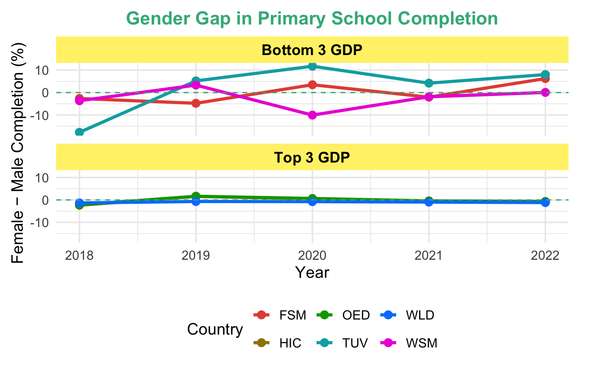

How does the gender gap in primary school completion differ between countries of high and low economic development, and what can this reveal about global patterns of gender inequality in education?

There are much larger gender disparities in the countries with the lowest 3 GDPs than the countries with the highest 3 GDPS. Some countries experience female disadvantages, while others experience female advantages. The variability in these countries is high, suggesting that gender inequality in these countries is less stable and possibly more sensitive to year-by-year changes like social or economic shifts. In contrast, high GDP countries cluster near zero, indicating that boys and girls complete primary school at nearly equal rates. Not only that, but they have much smaller variability, indicating that access to education is relatively equal between genders through global changes (for example, the 2020 Covid-19 pandemic). Because we can see that some countries in the low-GDP group see higher rates of girls’ education and others see higher rates of boys’, this visualization highlights that gender equality is shaped not only by the economy but also by cultural and political reforms in each country.