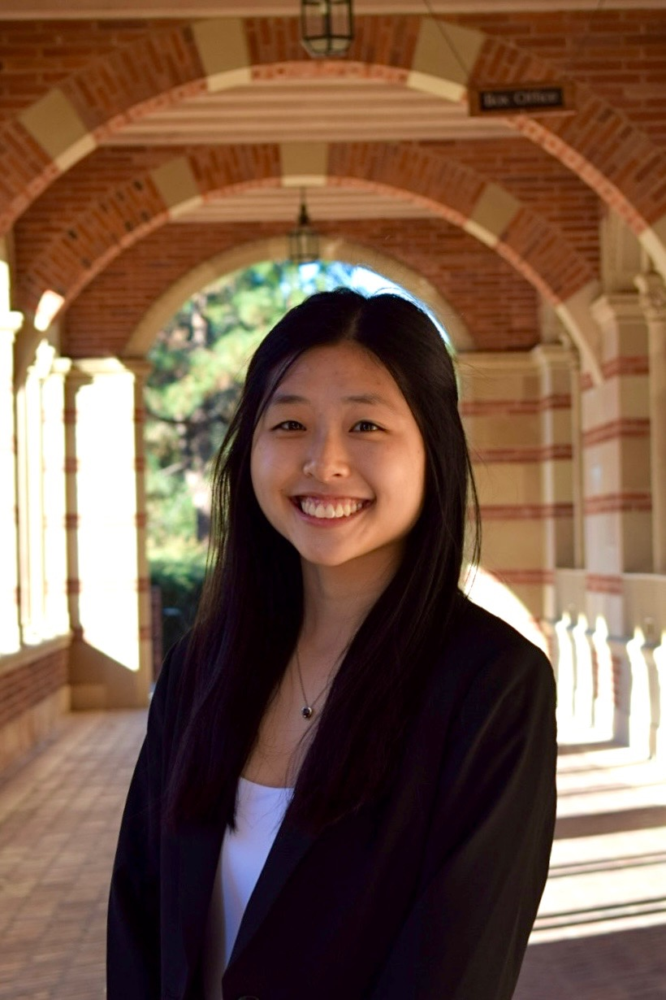
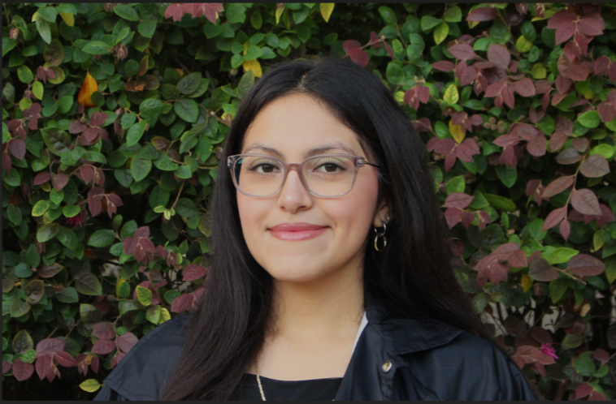

## Meet the Team

|  |  |
|------------------------------------|------------------------------------|
| {width="40%"} | **Cynthia Du**   Hi! I’m Cynthia Du, a 4th year Statistics + Data Science and Cognitive Science w/ a Specialization in Computing double major from Denver, CO! My role as the product manager is to ensure that our project flows smoothly and communication between the team is going well. In addition, I work with the rest of the team to generate the information needed for the site! |
| {width="40%"} | **Claire Hayashida**   Hi everyone! My name is Claire and I am a fourth-year Statistics and Data Science major and Accounting minor from Carlsbad, California. In my role as Data Specialist, I managed the cleaning and refining of our dataset sourced from the World Bank. |
| {width="40%"} | **Allison Lynn**   I'm Allison, a senior Statistics and Data Science Major from San Diego, California. I am the web designer, responsible for creating the website and designing it! I enjoy web designing so much and can't wait to portray our argument and project through this website! |
| {width="40%"} | **Tom Liu**   Hi, I’m Tom, a third year transfer student majoring in Sociology with a minor in digital humanities from Changchun, Northeastern China. My role as the content developer is to have written analysis according to the data visualizations and making sure that the narratives from our group is consistent and coherent. I will also collaborate with other team members during the final stage of the project to oversee the editing process. |
| {width="40%"} | **Koji Schafer**   Hi, I’m Koji Schafer, a third year International Development Studies Major and Global Health Minor from Culver City, California. My role as the editor is to oversee the overall “look” of the project to ensure consistent design, readability, and accessibility. In addition, I will eagerly collaborate with the rest of the team to successfully execute a meaningful body of work. |
| {width="60%"} | **Montserra Munoz-Garcia**   Hi, I’m Monse, a third year student majoring in Cognitive Science with a minor in Digital Humanities. In my role as data visualization specialist, is to ensure that chosen data is in the right format and is fine-tuned. |

## Our Project

We are a team of UCLA students investigating how women’s education shapes health outcomes across countries at varying stages of development. Our research explores how education serves as a critical determinant of women’s health by influencing fertility behavior, access to healthcare, and overall knowledge about reproductive and maternal health, particularly focusing on pre-post COVID influences. We argue that higher levels of education among women correlate with lower fertility rates, as education often delays marriage and childbearing while increasing awareness and use of family planning methods. Moreover, education enhances women’s ability to navigate healthcare systems such as improving access to prenatal and postnatal care, child immunization, and preventive services.

Beyond access, education empowers women with the knowledge to make informed health decisions, challenge harmful cultural norms, and advocate for their own well-being. By comparing data across countries at different stages of economic and social development, our project seeks to highlight how investments in women’s education not only improve individual health outcomes but also generate broader societal benefits, including reduced maternal mortality, healthier families, and more sustainable population growth. We believe this will allow us to produce a meaningful and inclusive project that will enable individuals around the world to understand our research question.

### Sources

The primary source for our data is the Gender Data Portal, created and funded by the World Bank Group. The portal is maintained by the World Bank’s Gender Group and the Development Economics Data Group, who update the dataset four times per year. Its development and continued improvement are also supported by several multi-donor trust funds, including the Umbrella Facility for Gender Equality, the Bill & Melinda Gates Foundation, and other long-term contributors.

Data featured in the Gender Data Portal is collected by national governments and major international organizations responsible for producing official, gender-disaggregated statistics. These contributors include national statistical offices, ministries of labor, health, education, and population, as well as international bodies such as UNDP, UNICEF, UN Women, UNESCO, the International Labour Organization (ILO), the World Health Organization (WHO), and the International Monetary Fund (IMF). These organizations gather standardized data from member countries, which the World Bank compiles and organizes within the Gender Data Portal to make global comparisons accessible and reliable.

We wanted to acknowledge the potential bias or silence that could be created and produced due to the nature of the World Bank and other International Non-Governmental Organizations that have been known to insert their own politics into the data that they present. This could inherently shape the ontology of the data and skew the interpretation of the argument that we are trying to convey. Although this can be the case, we believe the standardized data that has been utilized in the creation of this project by the World Bank offers the most accurate and wide range of data that encompasses and acknowledges everything that needs to be included to the best of our ability. 

### Processing

Since we drew our data from the Gender Data Portal, all of our data was drawn individually from the API by key variable name. This data for each variable indexed by economy (which was the country codes), and columned by year. We then had to do extensive processing of our data to get in the format where year was a single column in order to compile a larger dataset with multiple variables. We did this using Python with libraries such as pandas and numpy. After compiling the data in a usable format, we downloaded the raw data with 32 variables as a csv.

(We then had to do some imputations in order to handle missing values in the data. In order to increase the statistical significance of our analysis, we decided to remove all variables with over 50% of values missing. This left our data set with 15 variables. To impute the missing values in the remaining variables, we used R to first determine the approximate distribution of each variable; assigning each variable a skewness rating computed as the sample skewness of each variable using the e1071 package in RStudio. We then classified each variable with a skewness rating greater than 1 as “skewed” and each variable with a skewness rating less than 1 as “approximately symmetrical.” For each “skewed” variable, we then imputed the median of the variable’s existing observations into each missing observation. For each “approximately symmetrical” variable, we imputed the mean of the variable’s existing observation into each missing observation. In doing these imputations, we hope to minimize the effect of missing values on our data by hopefully replacing these missing values with an estimation of the true center of each variable.

In order to keep the data transparent and accurate, we opted to do minimal imputations for key variables we were investigated such as primary and lower-secondary education completion rates for females in order to keep the analysis accurate. However, we were still missing around 30% of the data for those variables, so we subsetted our analysis on those variables to include countries in a key time range (before v after COVID) in order to keep the data accurate and not imputed for our key variables. This restricted some of our analysis to be for countries with data, however in our data critique, we note how there may be certain reasons for lack of data for certain countries in certain years. We did this in order to ensure the ethics of our analysis.)- fix (not using any imputations, just subsets)

For our visualizations, we used Tableau and R to highlight patterns in the data. Tableau powered interactive dashboards that were easy for teammates with less coding experience to build and explore, while R supported more technical, analysis-heavy charts. Some of our team members also leveraged the Plotly library in R to add interactivity to custom graphics. In addition, we used Timeline.js to create an interactive chronology of global birth rates that paired narrative context with visuals.

### Presentation

Our site was developed in RStudio using Quarto, hosted on Netlify, and version-controlled with GitHub. The website has a white and mint color palette and texts are in black color to enhance the readability of the website using contrast. Every picture and data visualizations have alt text and descriptive headers to assist readers in their understanding. All headers follows a HTML structure which improves the accessibility of our website and provides directions for users when navigating.

To visualize our research outcomes, our website integrats several data visualizations of different variables in our data. The purpose of this was to understand how the level of education for women can impact the right of getting healthcare in different countries. Based on the data collected from the World Bank’s Gender Data Portal, our visualizations highlighted the intersectionality between education, gender equality, birth rate and the holistic social welfare of different societies. Through this work, our goal is to turn statistical data into a human centered narration that explores how education shapes women’s health and futures beyond the classroom.
